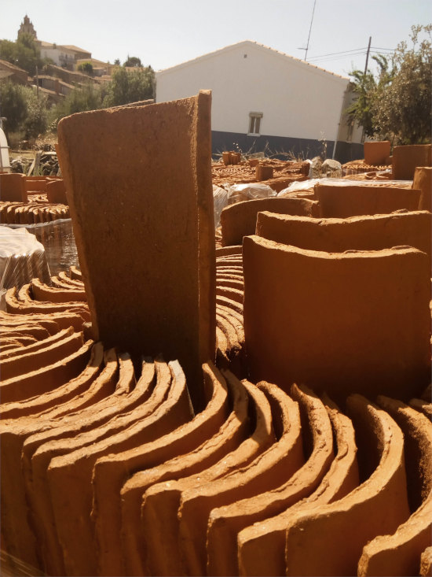
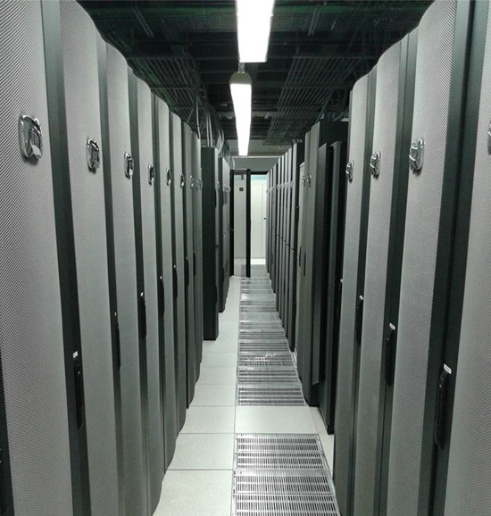

# tejar-dc
Tejar data center IaC repository.

 + 

## The data center

Please be welcome to my h{umble data center|ome lab}. See how it is built here:
- [Part I](https://manuelmc.pocosmhz.org/2025/04/13/proxmox-home-cluster-i.html)
- [Part II](https://manuelmc.pocosmhz.org/2025/04/15/proxmox-home-cluster-ii.html)

## The tools
The foundation of Tejar DC is [Proxmox VE](https://www.proxmox.com/en/). The setup process is detailed in the section above.

On top of that, this IaC repository will take care of all the resources that will make a good use of the hypervisor, through the following tools:

- [git-crypt](https://github.com/AGWA/git-crypt)
- [tenv](https://tofuutils.github.io/tenv/)
- [OpenTofu](https://opentofu.org/)
- [cloud-init](https://cloud-init.io/)
- [ssh-piper](https://github.com/tg123/sshpiper)

## Start using the repository
1. After you clone the repo, do this to have access to my private data:
    ```Shell
    git-crypt unlock /path/to/key
    ```

    This step is optional, as you can provide your own data.

2. Install `tenv` if you haven't yet, and then install OpenTofu by doing:
    ```Shell
    tenv opentofu install
    ```
3. If not logged in to the right Terraform Cloud workspace, go ahead and do:
    ```Shell
    cd pocosmhz/tejar-dc
    tofu login app.terraform.io
    ```
    You will be asked a few details.
4. Apply Tofu manifests by doing:
    ```Shell
    cd pocosmhz/tejar-dc
    ./apply.sh
    ```
